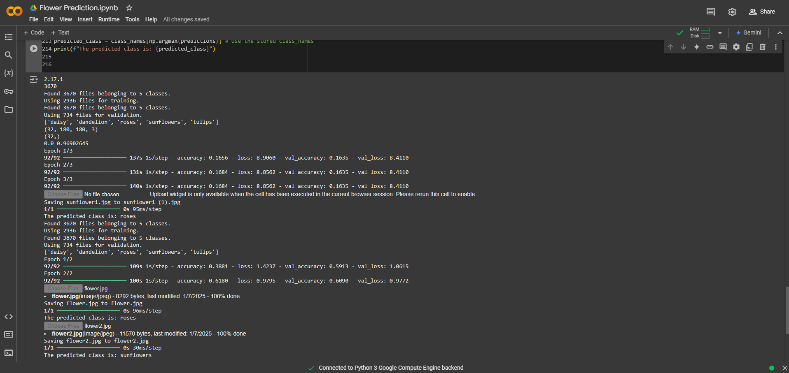

# 🌺 Flower Prediction🌻

This project builds a machine learning model to predict flower species based on features like petal length, petal width, sepal length, and sepal width. It covers data preprocessing, model training, and evaluation, aiming to predict flower types based on their physical attributes. The project emphasizes the importance of clean data, feature selection, and model evaluation to improve prediction accuracy.

## Features

- **Data Preprocessing**: This step involves cleaning and preparing the dataset to ensure it is free from errors, missing values, or inconsistencies, making it suitable for accurate model training.
- **Model Training**: A machine learning model is developed using the prepared dataset, learning patterns and relationships to classify different flower species effectively.
- **Performance Evaluation**: The trained model's performance is assessed using metrics such as accuracy, helping to ensure its reliability and effectiveness in predicting flower species.

## Screenshots



## Libraries Used

The following Python libraries are used in this project:

- pandas
- numpy
- matplotlib
- tensorflow
- Python Imaging Library (PIL)
  
## Setup and Usage

1. **Clone this Repository:**
   ```bash
   git clone https://github.com/sanketjadhav09/flower-prediction.git
   cd flower-prediction
   ```

2. **Open the `Flower_Prediction.ipynb` file on Google Colab:**
   - Upload the notebook to Google Drive.
   - Open it in Google Colab.

## Usage

1. Open the `Flower_Prediction.ipynb` file in Google Colab.
2. Follow the instructions in the notebook to run each cell sequentially.
3. View the results of the prediction and model evaluation.

## Project Structure

- `Flower_Prediction.ipynb`: Main Jupyter Notebook for the project.
- `output.png`: Screenshot of the model's output.
- `README.md`: Project overview and setup instructions.
  
## How It Works

1. **Data Preprocessing**: Prepares the dataset by handling missing values, normalizing data, and splitting it into training and testing sets.
2. **Model Training**: Uses a machine learning algorithm (e.g., Logistic Regression, Decision Tree) to classify flower species.
3. **Evaluation**: Compares predicted values against actual values to calculate accuracy and other performance metrics.

## License

This project is open-source and available under the MIT [LICENSE](LICENSE).

## Acknowledgements and Contributions

- Special thanks to **Google Colab** for providing a robust platform for running this notebook and to the datasets and libraries that made this project possible.
- **Contributions are welcome!** If you have suggestions for improvements or additional features, feel free to fork the repository, make changes, and submit a pull request. Your input is highly appreciated!

